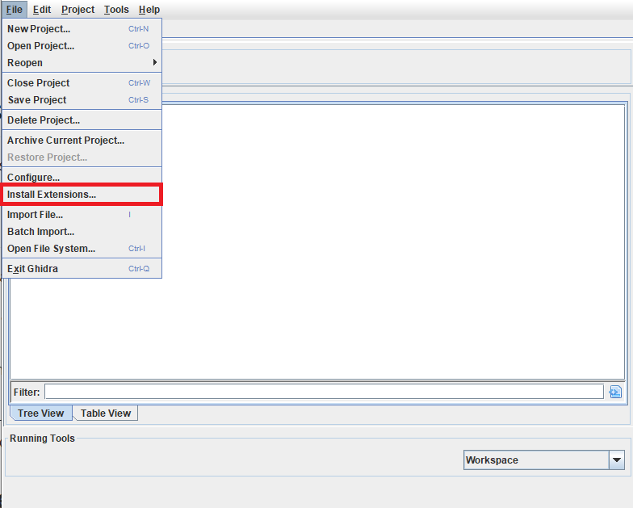
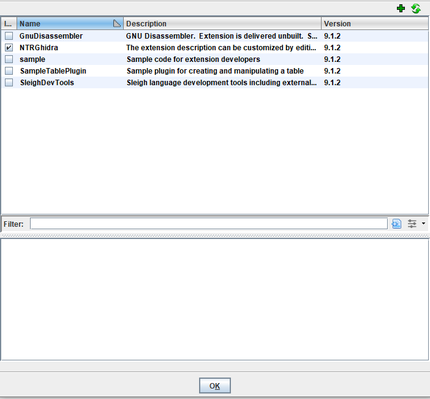

# NTRGhidra
 
A Nintendo DS Loader for Ghidra

Latest Ghidra version supported: 10.1.4 & 10.1.5

# License
NTRGhidra is released under the .

# Contributing & Support
* Fork, modify and pull request to contribute,
* Open issues suggesting feautures, reporting bugs, asking for documentation or changes, etc.
* Solve known problems reported in the  
* Support by starring the project.

# Features
A list of Completed / In Progress / To-Do features is available in [this listing](https://github.com/pedro-javierf/NTRGhidra/projects/1)

# Installation
If you just want to install the loader into a existing Ghidra installation:

1. Download the .zip from the [releases page](https://github.com/pedro-javierf/NTRGhidra/releases) (Or build the project yourself from the code, instructions below).
2. Put the .zip into the GHIDRA_INSTALL_DIR/Extensions/Ghidra folder
3. In the initial Ghidra window (not in the Code Browser), open the "File" menu, and select "Install Extensions". Click the small 'plus' icon in the top right of the window, and select the extension zip file downloaded. This should add an entry into the extensions list. Make sure it is checked and click OK.

4. Restart Ghidra.

# How to Build

NOTE: If you notice any exception while debugging with Eclipse, please 

These are the basic steps to debug and build the loader. You must have a Ghidra installation.

1. Install Ghidra
2. Install the Eclipse IDE
3. In Eclipse, install the Ghidra Development Extension. Click Help > "Install New Software" (https://stackoverflow.com/questions/31553376/eclipse-how-to-install-a-plugin-manually)
4. After the extension is installed, clone/download this repository, which contains an Eclipse project.
5. Open the project with Eclipse (File > Open Projects from File System)
6. Build: Select "File > Export", and then choose "Ghidra > Ghidra Module Extension". You can then use a local Gradle installation or an online build system.

# Acknowledgements
* Special thanks to [gbatek](https://problemkaputt.de/gbatek.htm) for ds technical info
* Thanks to Gericom for the original C# Header and ARM9 decompression code from EFE(Every File Explorer), as well as for testing.

# Others
For reference and tutorials about Ghidra loaders and how to write them, you may want to read:
* [Tutorial: Writing a Ghidra loader](https://pedro-javierf.github.io/devblog/tutorialwritingaghidraloader/)
* [Advanced Ghidra Loader: labels, overlays and Function ID](https://pedro-javierf.github.io/devblog/advancedghidraloader/)
