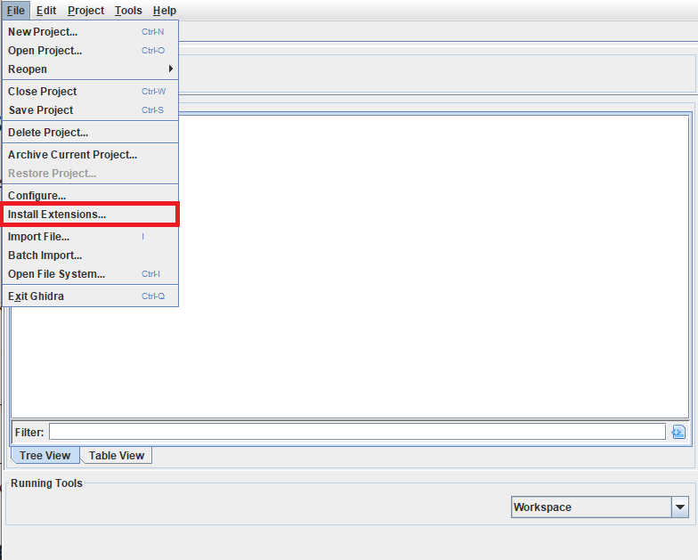
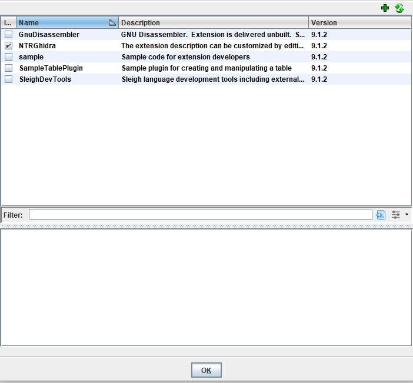

# NTRGhidra 

A Nintendo DS Loader and plugin for Ghidra


Latest Ghidra version supported: 12.0.4 (09/03/2026 | dd/mm/yyyy)

[](https://github.com/pedro-javierf/NTRGhidra/actions/workflows/build_ntrghidra.yml) <br>

# Installation
If you just want to install the loader into a existing Ghidra installation:

1. Download the .zip from the [releases page](https://github.com/pedro-javierf/NTRGhidra/releases) (Or build the project yourself from the code, instructions below).
2. Put the .zip into the GHIDRA_INSTALL_DIR/Extensions/Ghidra folder
3. In the initial Ghidra window (not in the Code Browser), open the "File" menu, and select "Install Extensions". Click the small 'plus' icon in the top right of the window, and select the extension zip file downloaded. This should add an entry into the extensions list. Make sure it is checked and click OK.





4. If you wish to dynamically load/unload overlays, you must activate this feature by activating the plugin features, using `File` -> `Configure` -> `Miscellaneous` -> `NTRGhidraPlugin` and enable NTRGhidraPlugin.


5. Restart Ghidra.

# How to Build yourself

NOTE: If you notice any exception while debugging with Eclipse, please 

These are the basic steps to debug and build the loader. You must have a Ghidra installation.

1. Install Ghidra
2. Install the Eclipse IDE
3. In Eclipse, install the Ghidra Development Extension. Click Help > "Install New Software" (https://stackoverflow.com/questions/31553376/eclipse-how-to-install-a-plugin-manually)
4. After the extension is installed, clone/download this repository, which contains an Eclipse project.
5. Open the project with Eclipse (File > Open Projects from File System)
6. You may need to reconnect Ghidra to the project by right clicking the project in Eclipse, and doing GhidraDev -> Link Ghidra...
7. Build: Select "File > Export", and then choose "Ghidra > Ghidra Module Extension". You can then use a local Gradle installation or an online build system.


# License
NTRGhidra is released under the .

# Contributing & Support
* Fork, modify and pull request to contribute,
* Open issues suggesting feautures, reporting bugs, asking for documentation or changes, etc.
* Solve known problems reported in the  
* Support by starring the project.

```diff
! This project is looking for maintainers and contributors --> If you'd like to join this effort
! and contribute or administer the project in any way, please open an issue to get in touch. Thank you!
```

# Features
A list of In Progress / To-Do / Completed features is available in [this listing](https://github.com/pedro-javierf/NTRGhidra/projects/1)

## Dynamic Overlay Loading example

Enable Plugin using `File` -> `Configure` -> `Miscellaneous` -> `NTRGhidraPlugin` before using:


Selecting desired overlays after loading:

(**Note**: this REQUIRES the program's original ROM file to be in the exact same file path as when it was imported into Ghidra. )


# Acknowledgements
* Special thanks to [gbatek](https://problemkaputt.de/gbatek.htm) for ds technical info
* Thanks to Gericom for the original C# Header and ARM9 decompression code from EFE(Every File Explorer), as well as for testing.

# Others
For reference and tutorials about Ghidra loaders and how to write them, you may want to read:
* [Tutorial: Writing a Ghidra loader](https://pedro-javierf.github.io/devblog/tutorialwritingaghidraloader/)
* [Advanced Ghidra Loader: labels, overlays and Function ID](https://pedro-javierf.github.io/devblog/advancedghidraloader/)
